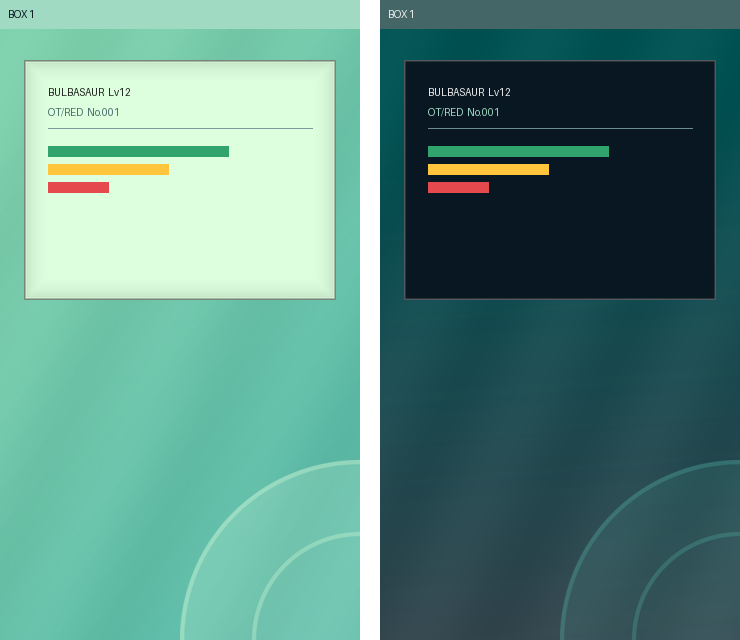

# OpenHome theme

[OpenHome](https://github.com/andrewbenington/OpenHome)'s look, as a mod
for this app: its teal and navy ramps, the diagonal gradient behind
everything, flat cards with a soft hairline, and its dark variant.

| Zip | Palette to pick | Look |
| --- | --- | --- |
| `OpenHome.zip` | OPENHOME | mint cards on a teal gradient |
| `OpenHome-Dark.zip` | OPENHOME DARK | navy cards on a navy-to-deep-teal gradient |

Import either with **OPTIONS → MODS → IMPORT MOD**, then pick it under
**OPTIONS → PALETTES**.

## What carries over

| OpenHome (`src/ui/App.css`) | Here |
| --- | --- |
| `--background-gradient` | `background.png`, the same angle and stops |
| `.radix-themes --color-panel` | `chrome.panel` |
| `--soft-border` | `border.png`, a hairline round each window over a faint inset shade |
| `--color-sidebar` | `chrome.barFill` |
| `--color-surface` | `chrome.surround` |
| teal-700 / teal-300, teal-500 / teal-600 | `chrome.shadow`, `chrome.muted` |
| Radix gray-12, green-9, amber-9, red-9 | `chrome.ink`, the HP bar |



Sprites keep their own colours (`tintsSprites: false`), as they do in
OpenHome.

What does not: OpenHome's rounded corners (a window here is filled as a
rectangle under its border, so a curve would sit over a square fill) and
its system font (a smooth face does not sit on this app's 8-pixel grid).
The ball is a quiet ring instead of a Poké Ball, and holds still.

## Rebuilding

Only colour values come from OpenHome; every picture is drawn by the
script, which also checks each one against the import scanner's
reference hashes before writing a zip.

```
pip install pillow
python3 tools/build_openhome_mod.py
```
