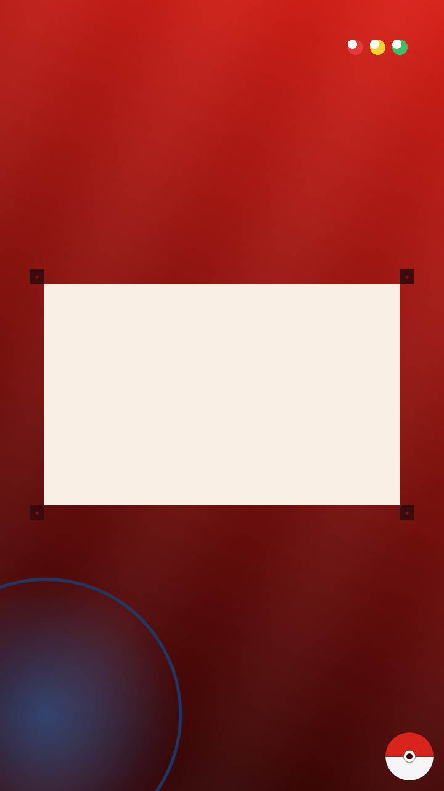

# Pokedex theme

Not a recreation of any one game's Pokedex screen — there is no ROM art
in this zip. It is this app's own frame, chrome and background, drawn
from scratch in the colours the device has always been known for: a red
shell, a pale screen, and the blue lens that sits in its corner.

Import with **OPTIONS → MODS → IMPORT MOD**, then pick **POKEDEX** under
**OPTIONS → PALETTES**.



## What it changes

| Piece | Look |
| --- | --- |
| `background.png` | red-to-maroon gradient, the blue lens glowing low in one corner, three status lights along the top |
| `border.png` | a dark bezel with a thin blue rim light, a screw dot in each corner |
| `ball.png` | a plain red-and-white Poké Ball, right way up, spinning |
| `chrome.panel` | a pale, warm screen colour, for the windows to sit on |
| `chrome.barFill` | the same lens blue, carried into the status bar |

Sprites keep their own colours (`tintsSprites: false`) — a dex reads a
Pokémon, it does not recolour it.

## Rebuilding

Every picture is drawn by the script, which checks each one against the
import scanner's own reference hashes before writing a zip.

```
pip install pillow
python3 tools/build_pokedex_mod.py
```
